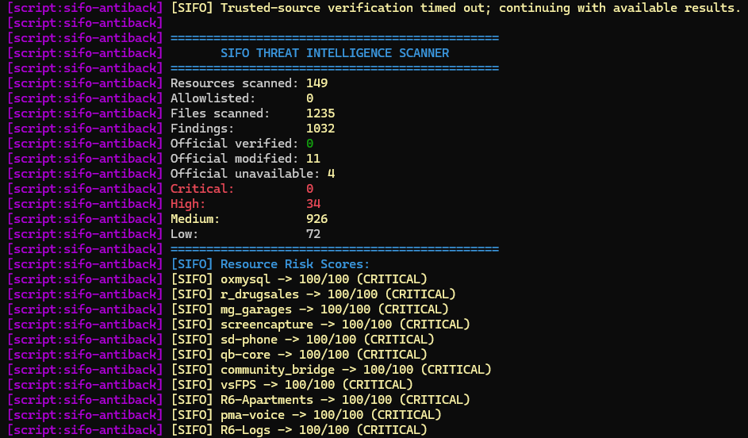
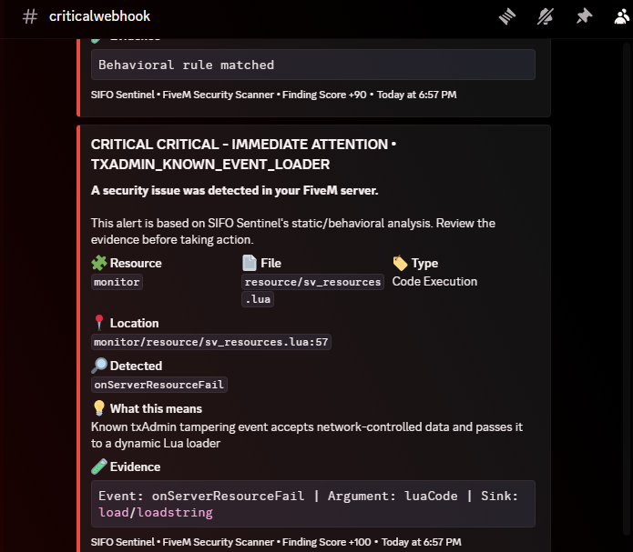

# 🛡️ SIFO Sentinel — FiveM Security Scanner

<p align="center">
  <b>Advanced FiveM Anti-Backdoor, Malware & Security Scanner</b><br>
  Protect your FiveM server by scanning resources for suspicious code, backdoors, RCE patterns, obfuscation and malicious behavior.
</p>

<p align="center">
  <b>Advanced FiveM Security & Anti-Backdoor Scanner</b><br>
  Detect suspicious code, backdoors, RCE patterns, obfuscation, resource manipulation and other security indicators.
</p>

---

<div align="center">

# 🛒 SIFO STORE

### 🚀 Take Your FiveM Server to the Next Level

**Looking for quality FiveM scripts and resources for your server?**

Explore the **SIFO Tebex Store** and discover the available resources.

<br>

<a href="https://sifo.tebex.store/" target="_blank">
  
</a>

<br><br>

**👉 https://sifo.tebex.store/**

</div>

---


## ✨ Features

- 🔍 Threat intelligence database
- 🧠 Behavioral security analysis
- 🚨 Remote Code Execution (RCE) detection
- 🛡️ Dedicated txAdmin monitor RCE detection
- 🔐 Detection of known backdoor indicators
- 🌐 Suspicious network / HTTP activity detection
- ⚙️ Resource manipulation detection
- 💻 Command execution abuse detection
- 📦 Suspicious file access detection
- 🎭 Lua obfuscation detection
- 🔢 Encoded / Base64 payload indicators
- 🎯 Suspicious event and NUI patterns
- 💰 Economy and inventory manipulation indicators
- 🗄️ Suspicious database execution patterns
- 🌍 Entity / network abuse indicators
- 📊 Risk scoring per resource
- 🔔 Discord webhook reporting
- 🔄 Automatic GitHub update system
- 📁 Modular scanner architecture

---

## 🖼️ Preview

### Server Console

> Add your console screenshot here.



### Discord Alerts

> Add your Discord alert screenshot here.



---

## 🚨 txAdmin RCE Detection

SIFO Sentinel includes a dedicated detector for the known txAdmin monitor Event-to-Code-Execution pattern.

The detector does **not** rely only on a specific event name. It analyzes the relationship between:

`RegisterNetEvent` → `AddEventHandler` → event argument → `load/loadstring` → function execution

This allows the scanner to identify renamed variants of the same dangerous behavior.

The known `monitor/resource/cl_playerlist.lua` pattern is also recognized and reported as a **CRITICAL** finding.

---

## 🔎 Known txAdmin Compromise Indicators

SIFO Sentinel includes dedicated detection for known txAdmin tampering patterns, including network-event-to-Lua execution chains found in modified `monitor` files.

One important IOC associated with this threat family is the txAdmin administrator username **`JohnsUrUncle`** (case variations may also appear). If this username appears unexpectedly in `txData/admins.json` or another txAdmin administrator record, it should be treated as a **high-priority compromise indicator** and investigated together with the other txAdmin findings.

The scanner also recognizes the known `helpEmptyCode` and `onServerResourceFail` event-to-`load/loadstring` execution patterns, as well as resource-reporting tampering and suspicious `sv_reportHeap.js` modifications.

> **Search reference:** If you find `JohnsUrUncle` in a compromised FiveM/txAdmin installation, searching the exact username can help operators identify the associated public threat reports and understand why the indicator matters.

## 🧠 Behavioral Detection & Correlation

The scanner does not automatically consider every FiveM API malicious.

SIFO Sentinel separates weak standalone indicators from actionable behavioral findings. Related indicators are correlated before they are treated as a higher-confidence security issue.

Examples of stronger behavioral chains include:

- Network-controlled input → `load/loadstring` → execution
- HTTP response/body → dynamic Lua execution
- Obfuscated/constructed data → dynamic execution
- Network event → sensitive server-side action
- NUI callback → sensitive server-side action
- Network event → entity lookup/control
- Network event → database execution

A remote URL or manifest dependency by itself is treated as a low-confidence indicator, rather than automatically producing a HIGH alert. This helps reduce false positives from legitimate resources that use remote dependencies.

The goal is to keep strong RCE/backdoor detections visible while reducing noisy alerts from common FiveM APIs and legitimate resource behavior.

---

## 📊 Risk Levels

Detected resources are assigned a risk level:

| Level | Score |
|---|---:|
| 🔴 CRITICAL | 80+ |
| 🟠 HIGH | 60–79 |
| 🟡 MEDIUM | 30–59 |
| 🔵 LOW | 1–29 |
| 🟢 CLEAN | 0 |

A finding's severity is based on the detected indicator or behavior. The score is intended as a triage signal, not proof by itself that a resource is malicious.

---

## ⚡ Zero-Configuration Operation

SIFO Sentinel is designed to work **standalone**.

No Discord webhook is required for the scanner itself. If Discord reporting is enabled, webhook URLs are configured directly in `config.lua`; no Discord webhook convars are used.

After installation:

1. Start the resource.
2. SIFO Sentinel automatically starts its scan.
3. Results are printed directly to the server console.
4. Risk information is available through the built-in commands.

This design keeps the core scanner independent from external services and reduces the number of configuration points that could be disabled or misconfigured.

## 🔔 Discord Reporting & Rate-Limit Protection

Discord reporting is optional and configured only through `config.lua`.

SIFO Sentinel includes a webhook queue that:

- Queues outgoing Discord alerts instead of sending large bursts.
- Batches multiple findings into Discord messages where possible.
- Respects Discord `429` rate-limit responses.
- Uses the server-provided retry delay when available.
- Requeues rate-limited alerts instead of silently dropping them.

This prevents large scans from producing a flood of webhook requests and reduces `HTTP 429` errors.

## 🔄 Automatic Updates

SIFO Sentinel includes an automatic GitHub update checker.

When the resource starts, it checks the official repository for a newer version.

If an update is available:

1. The new files are downloaded.
2. The current running version remains active.
3. The downloaded version is loaded on the next resource/server restart.

### Version

Current release:

**v1.0.13**

---

## 🔎 Search Keywords

**FiveM Security Scanner • FiveM Anti Backdoor • FiveM Anti Malware • FiveM Malware Scanner • FiveM Backdoor Detector • FiveM RCE Scanner • FiveM Security Tool • FiveM Resource Scanner • FiveM Script Security • FiveM Lua Security • txAdmin Security • txAdmin RCE Detection • txAdmin JohnsUrUncle • JohnsUrUncle txAdmin • JohnsUrUncle FiveM • FiveM Anti Exploit • FiveM Server Protection • FiveM QBCore Security • FiveM ESX Security**

SIFO Sentinel is built for FiveM server owners, developers and communities that want to inspect FiveM resources and identify suspicious or potentially malicious code before it becomes a server security problem.

---

## ⚙️ Commands

Run these commands from the server console:

```
sifo_scan
sifo_risk
```

### `sifo_scan`

Starts a complete security scan of the configured FiveM resources.

### `sifo_risk`

Displays resource risk information collected by the scanner.

---

## 📁 Project Structure

```text
sifo-antibackdoor/
│
├── fxmanifest.lua
├── config.lua
├── threats.lua
├── rules.lua
├── updater.lua
├── update_manifest.json
├── version.txt
│
└── server/
    ├── main.lua
    ├── threat_scanner.lua
    ├── behavior_scanner.lua
    ├── rules_scanner.lua
    ├── resource_scanner.lua
    ├── reporter.lua
    └── commands.lua
```

---

## 🛠️ Installation

1. Download or purchase the resource.
2. Place `sifo-antibackdoor` inside your FiveM resources folder.
3. Add it to `server.cfg`:

```cfg
ensure sifo-antibackdoor
```

4. Configure `config.lua` if needed.
5. Start/restart the server.
6. The scanner will automatically perform its startup scan.

---

## ⚙️ Configuration

All settings are located in:

```text
config.lua
```

No personal SIFO Discord webhook, private webhook URL or GitHub credential is included in the public package. Customers must enter their own Discord webhooks if they want Discord reporting.

For a private GitHub repository, set `Config.GitHub.Token` in `config.lua`. The updater never uses server.cfg convars.

You can configure:

- Discord reporting and webhook URLs
- GitHub authentication for private repository updates
- Scan delay
- Automatic scanning
- Resource allowlist
- Indicator allowlist
- File extensions
- Obfuscation thresholds
- Local forensic reports

---

## 📋 Supported File Types

By default, the scanner checks:

```text
.lua
.js
.json
.cfg
.txt
.sql
.html
.css
```

The scanner uses resource metadata to determine which files are available to scan.

---

## ⚠️ Important Security Notice

SIFO Sentinel is a **heuristic and signature-based security scanner**.

No static scanner can guarantee detection of every possible malicious resource, especially previously unknown or heavily customized attacks.

A **CRITICAL** finding should be investigated rather than treated as automatic proof of compromise.

For best security, combine the scanner with:

- Trusted resource sources
- Regular server audits
- Restricted server permissions
- Secure txAdmin configuration
- Protected server credentials
- Monitoring of unexpected resource changes

---

## 📜 License

This project is distributed by **SIFO Scripts**.

Do not redistribute, resell, re-upload or claim this resource as your own without permission.

**Resource name:** `sifo-antibackdoor`  
**Product name:** `SIFO Sentinel`

---

## 📞 Support

For support, updates, bug reports and other SIFO Scripts:

**Discord:** https://discord.gg/CEw6y3SY9h

---

<p align="center">
  <b>© SIFO Scripts</b><br>
  FiveM Development • Security • Scripts
</p>
